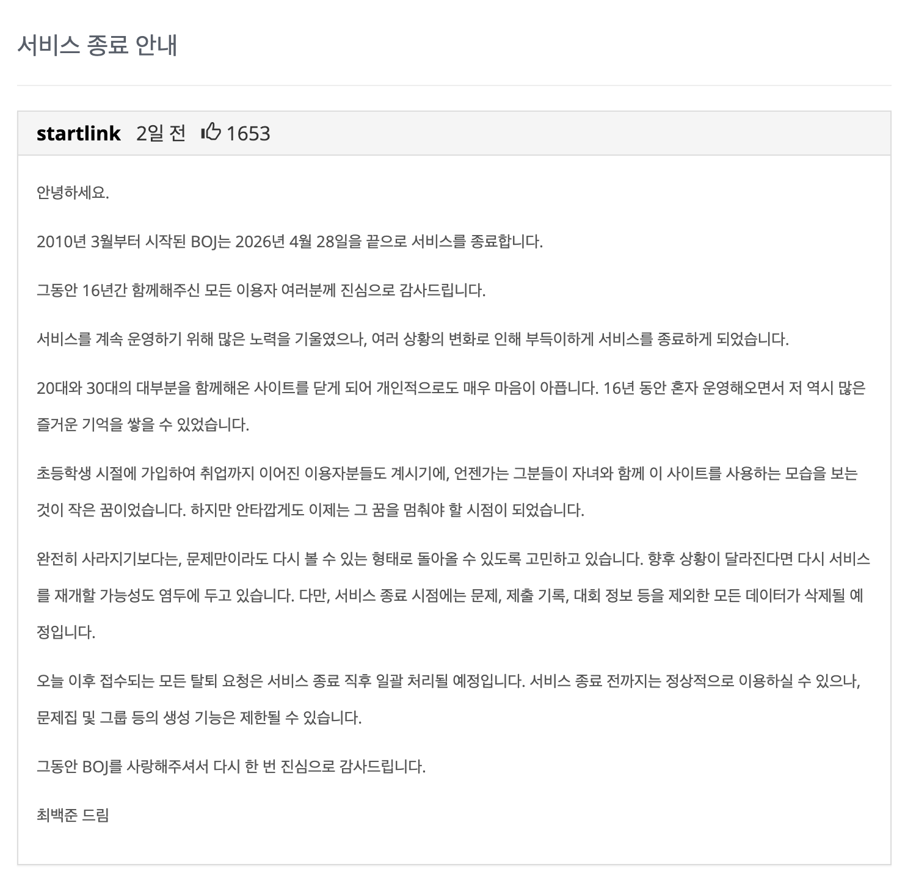
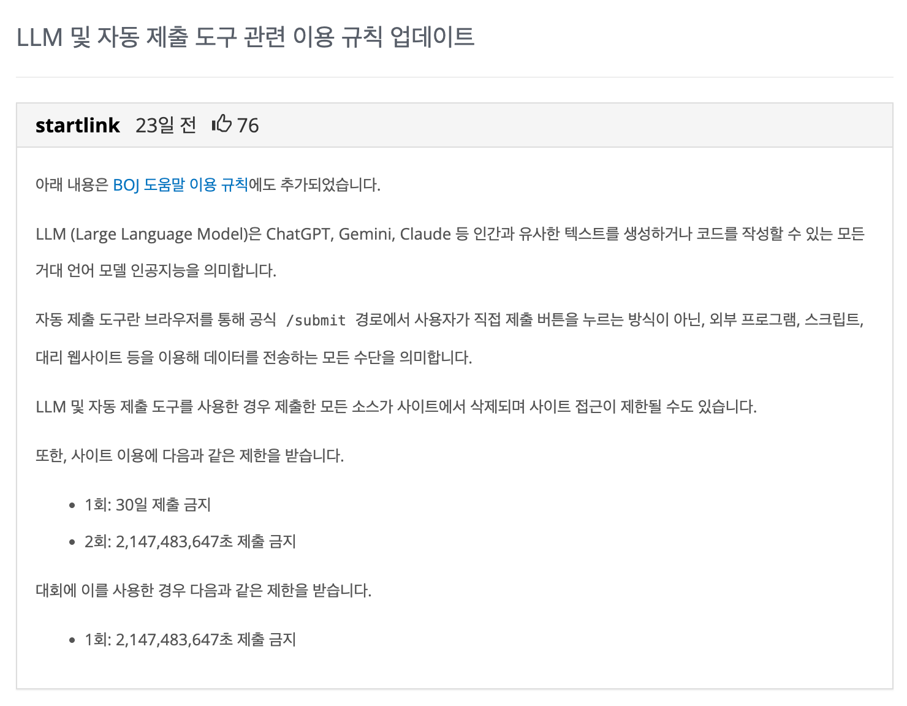
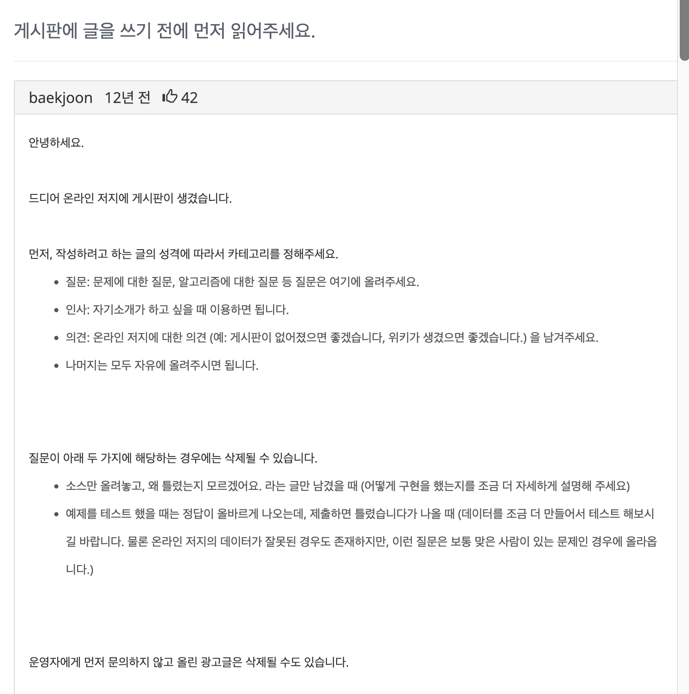
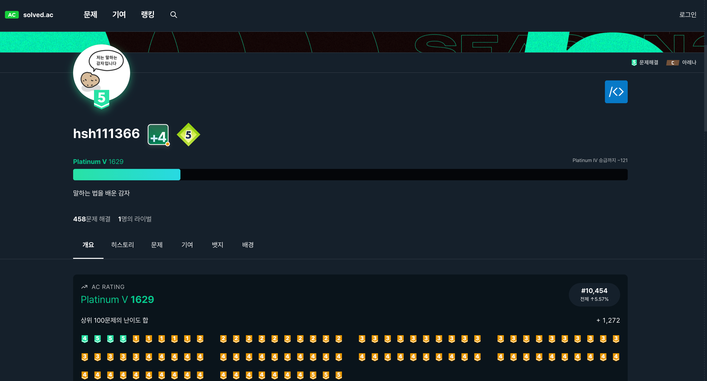

# 서론

얼마 전 일을 하던 중 개인적으로 충격적인 소식을 들었다.

국내에서 가장 유명한 PS 사이트인 `백준`이 서비스 종료를 한다는 것이었다. 개발자라면 모르는 사람이 없는 사이트이기 때문에 예상을 전혀 하지 못 했다.

곰곰이 생각을 하다 보니, 이는 단순히 서비스 하나가 종료를 한 것이 아니라 시대가 많이 변한 것이라는 느낌을 받았다.

백준을 한 때 많이 애용했던 이용자로서, 그동안을 돌아보고 최근 시대에 대한 고찰도 해 보고자 글을 작성하게 되었다.

---

# 왜 종료까지 하게 되었을까

> **국내 1위인 사이트가 대체 왜 '종료까지' 하는 결정을 내리게 되었을까?**

이 부분은 오로지 나의 생각이 담겨있으며 공식적인 근거는 없다.
## AI 시대의 역풍

아무래도 가장 큰 이유는 `AI` 일 듯하다.

취업 준비를 할 때까지는 종종 들어가서 문제를 풀었지만, 일을 시작하고부터는 아예 들어간 적이 없어서 상황을 잘 몰랐다. 본격적인 AI 시대에 접어들면서, **코딩테스트라는 것 자체에 대한 회의적인 분위기**와 **LLM을 사용한 문제풀이** 등이 성행했다고 한다.

그렇기에 위와 같은 공지도 작성하며 제재를 시도하셨지만 아마 역부족이었던 것으로 보인다.
이전에는 몇시간을 고민해도 나오지 않던 답이, LLM은 몇 초만에 뽑아내니 운영자도 이용자들도 아마 회의감이 많이 들었을 것이다.

필자도 **코딩테스트**라는 것 자체를 원래부터 선호하지는 않았지만, 어쩔 수 없이 해야하니까 꽤나 열심히 했었다. 마치 어릴 때 공부하던 내신처럼 말이다. 그렇다고 도움이 아예 안 되는 행위는 아니었다. 문제를 풀며 아래와 같은 부분들을 배웠다고 생각한다.

> 1. 개발 언어에 대한 기본적인 이해와 문법
> 2. 기본적인(또는 필수적인) 알고리즘
> 3. 조금 더 좋은 구조, 조금 더 최적화 된 코드를 위한 고민과 사고방식
> 4. 몇 시간 넘게 고민할 수 있는 집중력과 끈기

**그러나 이제는 시대가 많이 변했다.**
몇 시간 동안 고민을 하고 AI와 함께 개발을 하면, 정말로 돌아가는 서비스를 만들어 낼 수도 있다. 이제는 이전보다 몇배 ~ 몇십배 이상 **시간의 가치가 높아졌다**. 이전과 동일하게 공부를 하고 문제를 풀려고 해도, 주변에서 들려오는 여러 AI 소식들이 마음을 헤집어 놓게 되었다.

필자의 경우에도 AI 활용과 기존의 공부방식 사이에서 마음의 줄타기를 하며 많이 혼란스러웠던 시기가 있었다. 그러다가 클로드코드를 제대로 활용해 보며 지금은 AI로 마음이 많이 기울어진 상태이다.

이전처럼 몇 달 ~ 몇 년을 공부만 하고 있기에는 **당장 며칠 뒤의 미래도 나에게는 위협**이라고 느껴졌다. 아마 이러한 마음을 많이들 느꼈을 것이고, 이것이 서비스 종료를 가속화하지 않았을까 감히 예상해 본다.

## 개인적인 힘듦

시대상을 제쳐놓고 보더라도, `16년 동안 홀로 서비스를 유지했다는 점이 운영자를 많이 지치게 하지 않았을까` 라는 생각이 든다.

[링크](https://www.acmicpc.net/board/view/45)

게시판에 첫 글을 작성하신 게 무려 12년 전이다. 그리고 이후로도 서비스 종료까지 꾸준하게 업데이트를 하고 소통을 시도하셨다. 대회도 지속적으로 개최되었고, 적어도 내가 사용할 때는 치명적인 서비스 장애가 발생하지도 않았다.

이용자는 당연하게 생각하였던 것들이, 운영자에게는 리소스와 정신을 소모하는 일이었을 것이다. 이정도 규모이기에 당연히 많은 팀원이 있을 줄 알았는데, 여태까지 홀로 운영하셨다는 게 놀라울 따름이다.

필자도 약 2년째 [원타임](https://www.onetime-with-members.com/)이라는 서비스를 운영중에 있다. 서비스를 이용해 주시는 분들이 여전히 많기 때문에 감사함과 뿌듯함도 많이 느끼고 있다. 하지만 확실히 첫 사용자를 받고 폭발적으로 성장했을 때 보다는 스스로 정체되고 지쳤음을 느낀다.

2년만 해도 이정도인데 16년 동안 하면 어떠한 감정이 들었을까? 상상이 잘 되지 않는다. 때로는 쉬고 싶고 놓고 싶었을 것이다. 부담감과 동시에 행복감이 있었을 것이고, 이는 스스로를 힘들게 함과 동시에 또 다시 움직이게 하는 동력이 되었을 것이라 예상해 본다.

---

# 백준을 이용했던 시절

지금부터는 내가 과거에 백준을 열심히 이용했던 시절을 돌아보려고 한다.

## 플래티넘 티어 달성

필자의 백준 티어는 플래티넘5이다. 이를 달성한 것은 23년 8월 29일로 보인다.

사실 그렇게 알고리즘을 잘 풀지도 않고, 엄청 좋아하는 것도 아니지만 노력으로 달성을 했었다. 그 덕에 코딩테스트를 통과하고 면접까지 가는 경험들도 할 수 있게 되었다.

물론 기업 코딩테스트 난이도가 점점 괴랄해지며 플래티넘5 수준도 쉽게 통과할 수 없게 되었지만..그래도 당시에는 꽤나 노력해야만 달성할 수 있는 티어였다.

## 나에게 백준이란

본격적으로 백준을 풀기 시작한 게 23년 4월 즈음 이었고, 약 4개월 후인 8월에 플래티넘 등급을 달성하였다. 아마 하루에 2~3문제 이상씩은 풀었던 것으로 기억이 난다.

> **나는 왜 그렇게 열심히 풀었을까?**

당시 나는 비전공자로 백엔드 개발자에 도전한 지 몇 개월 되지 않은 상황이었다. 당장 어떤 것부터 배워야 하고 누구에게 도움을 청해야 할 지도 감이 오지 않았다.

결국 내가 할 수 있는 것은 그나마 알고리즘 문제를 열심히 풀어나가는 것이었고, 당시 외롭고 생각이 많았던 나에게 즐거움과 성취감을 주는 존재였다.

원래는 골드 3~4정도까지만 달성을 하고 다른 부분에 집중을 하려고도 했었다. 하지만 하다보니 욕심이 났고, 이왕 하는 김에 주변에 많이 없었던 플래티넘 등급까지 달성하고 싶었다. 물론 등급이 높다고 실력이 좋은 것은 아니었다.

> 하지만 `나도 이정도까지 할 수 있구나` 라는 이 때의 경험이 이후의 나를 만들었다고 생각한다.

## 그 이후

**무엇인가 노력했다라는 경험은 나에게 강점이 되었다.**

첫 프로젝트를 경험할 수 있는 대학교 전공 수업이 있었다. 당시 투두 리스트 정도의 토이 프로젝트 수준만 만들어 보았지만, 백준 티어를 앞세워 어필했고 결국 좋은 팀원들을 만나서 백엔드로 [첫 프로젝트](https://bbbang105.github.io/%ED%9A%8C%EA%B3%A0/%ED%94%84%EB%A1%9C%EC%A0%9D%ED%8A%B8/23-2-%EC%98%A4%ED%94%88%EC%86%8C%EC%8A%A4-%ED%94%84%EB%A1%9C%EC%A0%9D%ED%8A%B8-%ED%9A%8C%EA%B3%A0%EB%A1%9D-%F0%9F%8F%BB)를 성공적으로 완수할 수 있었다. (물론 이것도 엄청나게 힘들었다..)

또한 나에게 정말 중요한 경험인 [큐시즘 합격](https://bbbang105.github.io/%ED%81%90%EC%8B%9C%EC%A6%98/29%EA%B8%B0/%EA%B0%9C%EB%B0%9C-%EB%B0%B1%EC%97%94%EB%93%9C%ED%8C%8C%ED%8A%B8-%ED%95%A9%EA%B2%A9-%EC%88%98%EA%B8%B0-%F0%9F%8F%BB)에도 기여했다.
객관적으로 보면 정말 부족한 실력이었지만, 1번의 프로젝트 경험과 알고리즘 학습을 잘 어필해서 합격할 수 있었다. 그리고 정말 많은 것을 배우고 좋은 사람들을 만날 수 있었다.

큐시즘에서 만난 인연으로 원타임 서비스를 만들 수 있었고, 이는 나의 취업에도 큰 도움을 주었다.

> 이러한 결과를 돌아보며, "정말 열심히 한 경험은, 언젠가 도움이 된다." 라는 생각을 갖게 되었다.

---

# 앞으로를 생각해 보며

마지막으로 앞으로의 시대를 예상해 보고, 그 안에서 필자는 어떻게 행동해야 할 것인지 적어보며 마무리하려고 한다.
## 코딩테스트의 몰락

나는 **몇 년 안에는 코딩테스트 제도가 없어질 것**이라고 예상을 한다.
사실 이렇게까지 생각을 하지는 않았었는데, 이번 일을 통해서 더욱 강하게 느끼게 되었다.

물론 아직 프로그래머스도 건재하고 외국에 있는 PS 사이트들도 다수 존재한다. 그러나 점차 기업에서 원하는 인재상 - **특히 신입에 대한 기준이 많이 변하고 있으며 이를 평가하기에는 코딩테스트가 적합하지 않다.**

AI를 적극적으로 사용하는 것을 넘어 자유자재로 활용하는, **AI 네이티브 엔지니어**를 많이 채용하려는 움직임이 보인다. 이들을 평가하기 위해서는, 코딩테스트 보다 AI 툴을 자유롭게 활용하여 하나의 결과물을 제출하는 **과제테스트 형태가 더 적절하다.** 실제로 최근 있었던 무신사 AI 루키 채용에서도 이러한 형태의 테스트였던 것으로 알고 있다.

개인적으로 `왜 해야 하는지 모르겠는 일을 해야 하는 것` 을 굉장히 싫어한다. 예를 들어 어릴 적 영어 내신 공부를 하며 영어 지문을 통째로 암기했던 일이나 / 대기업 자기소개서를 작성하기 위해 소설을 쓰는 일 등 말이다. 물론 하기 싫어도 해야 하는 일이 있는 것은 알고, 해야 한다면 잘하려고 노력하는 편이다. 하지만 이왕이면 내가 하고 싶은 일, **정확히는 내가 시간과 열정을 쏟아서 실패해도 상관없는 일**을 하는 것을 선호한다.

> 그렇다면 결과적으로 실패라 하더라도, 나에게는 얻은 게 있으니 실패가 아니기 때문이다.

그런 의미에서 지금 흘러가는 상황이 필자는 마음에 든다. 앞으로는 조금 더 의미 있는 평가제도 - **특히 우리 회사에 정말 필요로 하는 인재를 찾기 위해 노력하는 움직임이 많아질 것으로 기대**되기 때문이다.

**1명의 제대로 된 인재를 뽑는 것**이 너무나도 중요해진 요즘이기 때문에, 당연한 일인 것 같다.

## 나는 어떻게 해야 할까

올해 들어 정말 고민이 많았다. 아직 경험과 기초 지식이 너무나도 부족한 주니어이기 때문에 정공법으로 공부를 해야 할 지 vs AI를 미친듯이 활용해서 트렌드를 따라가야 할지..

결과적으로 현재의 나는 아래와 같은 스탠스를 가지고 있다.

> 1. AI는 무조건 적극적으로 활용해야 한다.
> 2. 단, 모든 사람의 말을 믿을 필요는 없고 누군가의 방법이 나에게도 정답은 아니라는 것을 알아야 한다.
> 3. 즉, 나만의 AI 활용법을 만들고 나 또는 주변의 비효율을 개선하기 위해 힘써야 한다.
> 4. AI를 활용하다가 모르는 개념이 나오면 넘어가지 말고, 잠깐만이라도 관심을 갖고 공부해야 한다. 적어도 용어의 의미나 사용되는 흐름 정도는 파악해야 한다.
> 5. 서비스를 많이 찍어내는 것이 능사는 아니다. 개발자라면 가치 있는 서비스를 만들고 이를 꾸준히 개선 및 유지보수 할 줄 알아야 한다. 가치를 전달할 수 없는 서비스는 폐기하는 것이 낫다.
> 6. AI 활용으로 인해 남는 시간에는, 트렌드를 파악하거나 사람에게 더 관심을 가지려고 노력해야 한다.
> 7. 결국 사람은 사람때문에 사는 것이고, 앞으로 더욱 인간적인 것일수록 가치가 높아질 것이기 때문이다.

당장 며칠 뒤에도 무슨 변화가 생길지는 모르겠지만, 지금 상황에서 할수 있는 것들을 최대한 하며 슬기롭게 이겨내보고자 한다!

---

> 작성 시간: 1시간 20분
