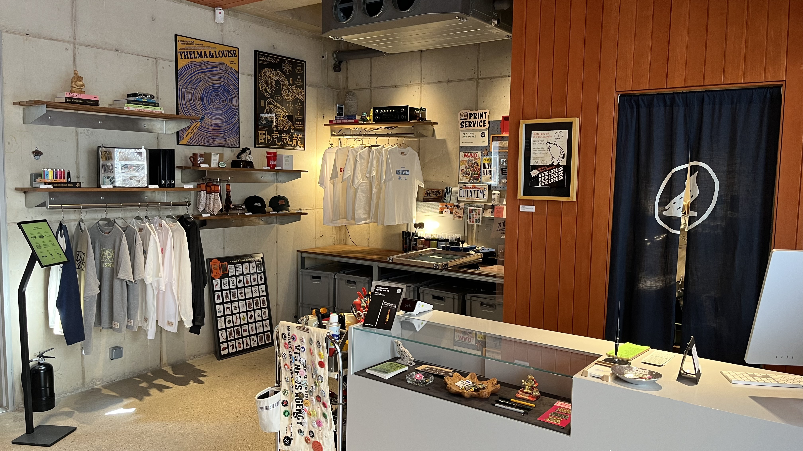
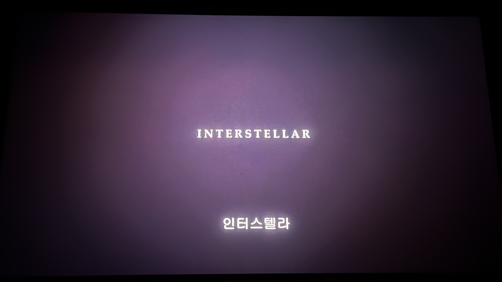
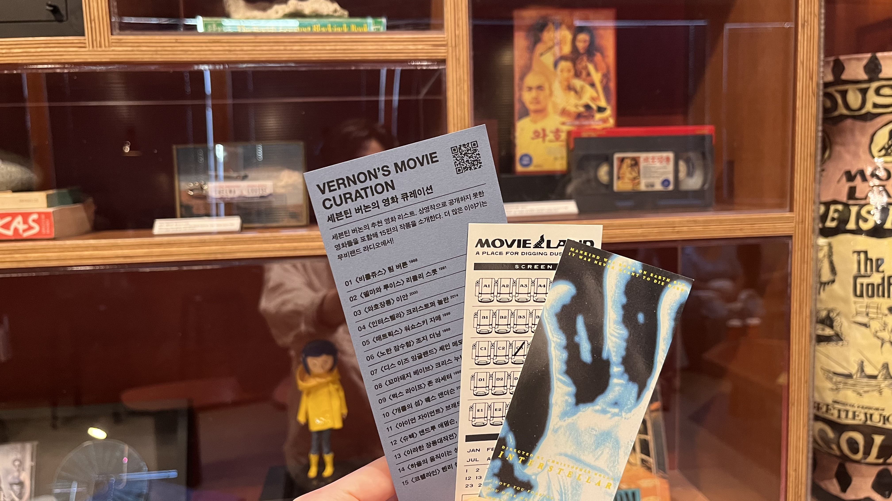
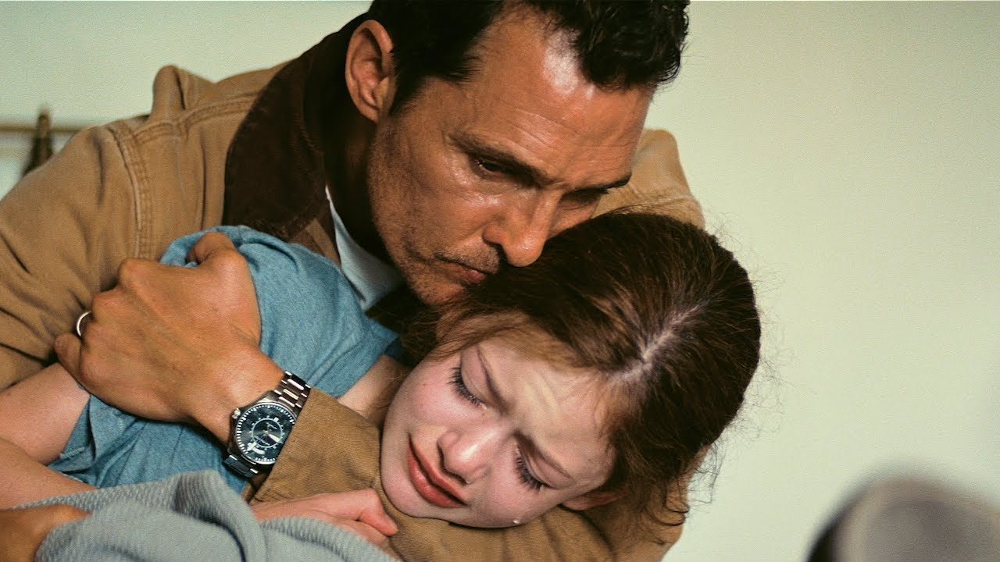
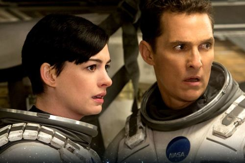
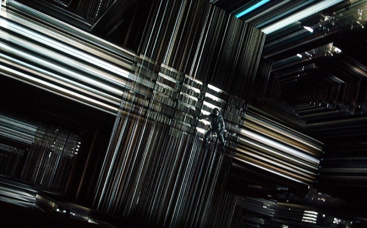
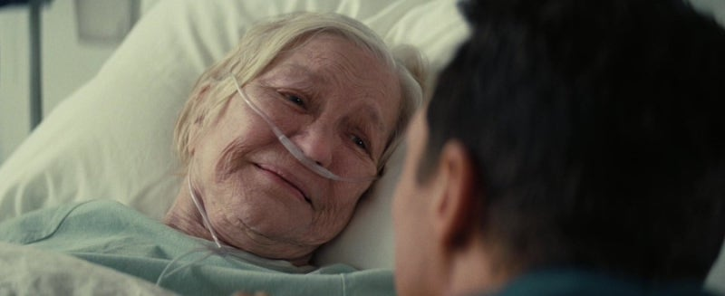
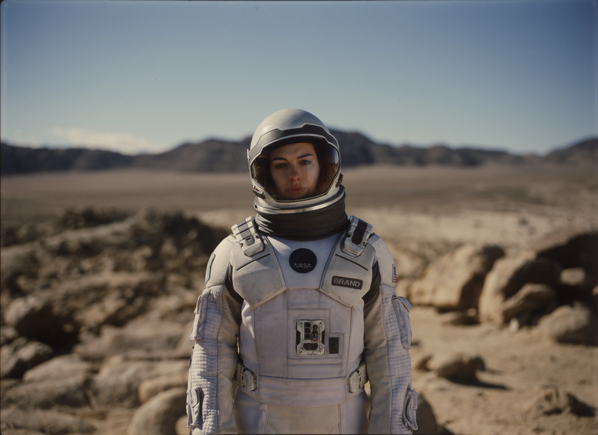
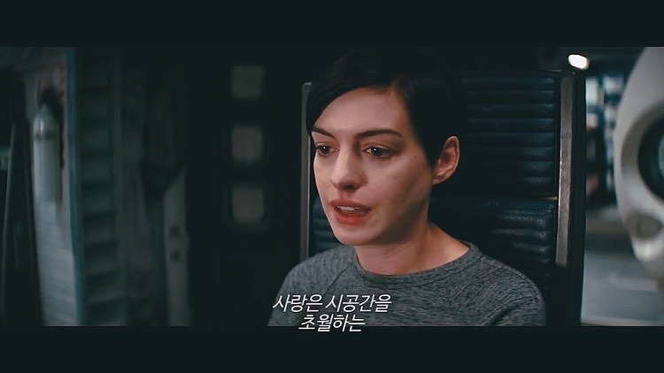

# 서론

이번에는 조금 라이트한 일상 글을 적어보려고 한다!

최근에 성수에 있는 `무비랜드` 라는 곳에서 영화 *인터스텔라*를 오랜만에 다시 보았다. 내 기억상 중학생 때 매우 재미있게 보았던 영화인데, 3시간이 넘는 러닝타임에도 지루하지 않게 볼 수 있었다는 것이 명작임을 증명하는 듯하다.

무비랜드라는 곳도 예전에 유튜브에서 제작기를 우연히 본 후로 계속 관심을 가졌었는데, 이번에 방문해 볼 수 있어서 좋았다. 생각보다 영화관 내부 퀄리티도 좋았고, 스낵류도 가성비 좋게 엄청 맛있었다. 굿즈들이나 인테리어 구경하는 맛도 쏠쏠했다. 성수에서 놀거나 데이트할 일이 있다면 추천!

ps. 마침 내가 즐겨보는 채널인 `최성운의 사고실험` 채널에도 2일 전 나오셨다 ㅎ.ㅎ  | [유튜브 링크](https://www.youtube.com/watch?v=pZ6g6zIa34w&t=3999s)

영화를 재미있게 보기도 했고, 이전과는 다르게 느껴졌던 부분들도 많았어서 생각을 글로 남겨보고자 글을 작성하게 되었다.

---

# 영화를 보며

지금부터는 영화를 보며 특정 장면에서 내가 느낀 감정들이나 흥미로웠던 부분들을 적어보려고 한다.

## 머피와의 이별

영화 초반에는 지구의 상태가 좋지 않음을 알림과 동시에, 아버지인 '쿠퍼'가 가족들과 이별하는 장면이 나온다.
다른 가족들과는 비교적 덤덤하게 이별하지만, 딸인 '머피'와는 이별이 매우 힘들었다.

쿠퍼는 무엇에 홀리기라도 한듯, 지구를 떠나야 함을 직감하고 있다. 이미 마음을 정했기에 딸과 최대한 아름다운 이별을 하고 싶지만 쉽지 않다. 머피는 아빠에게 화가 났고, 한동안 계속 보이던 유령 이야기를 하며 잡아보려고 한다. - 유령이 떠나면 안 된다고 말했다고 하며.

> 둘은 결국 이별했고, 아주 긴 시간 동안 이별했다.

이 장면에서 눈물이 많이 났다. 어릴 때는 기억도 안 날 정도의 장면이었는데, 이제 보니 너무 절절하고 많은 복선들이 깔려있는 장면이었다. 두 번째로 보니, 이후 쿠퍼가 하게 될 후회를 이미 알고 있어 더 그랬던 것 같다.

스스로 왜 눈물이 났는지 생각을 해보았다. 일단 예전보다 내가 나이를 꽤나 먹었다. 사회에도 나오고, 돈이나 미래에 대한 생각도 많이 하다보니 자연스럽게 `아버지` 라는 존재에 대해 생각을 하게 되었다.

아버지인 쿠퍼도 이 상황이 많이 혼란스럽고 두려웠을 것이다. 그리고 언제 돌아올지 확답할 수 없는 사실에 더욱 답답했을 것이다. 그렇지만 지구, 더 좁혀나가 가족을 위해서 우주로 나가는 선택을 해야만 했다. 딸은 이러한 아버지의 마음을 알 턱이 없다. 아직 나이가 너무 어리기에 그 사실을 강제로 알려줄 수조차 없다.

> 그렇기에 결국 모든 선택은 아버지가 책임져야만 한다.

아직 난 아버지가 되지 못 했지만, 아버지인 쿠퍼의 입장에서 감정 이입을 해보니 너무나 외로울 것 같다는 생각이 들었다. 감히 난 그러한 감정을 다 헤아릴 수 없지만, 나의 아버지를 비롯하여 많은 책임을 다하고 있을 아버지를 떠올리니 자연스레 눈물이 난 듯하다.

## 인간은 가족외에는 무섭도록 무관심하다

어떤 장면에서 나온 말인지는 기억이 안나지만, 이상하게도 기억에 남는 문구이다.

인간은 결국 극한의 상황이 닥쳐오면 본인과 가족의 안전만 챙기게 된다. 나는 가족에서 더 나아가서, 궁극적으로는 `본인`을 챙긴다고 생각한다. 가족이라는 존재는 너무도 감사하지만, 본질적으로 `나`는 아니기 때문에.. 이기적으로 들릴 수도 있겠지만 가족 또한 `남`이고 모든 것은 나에게 달려있다고 생각하기 때문이다.

하지만 아이러니하게도 많은 사람들이 가족과 나를 제외한 타인들에게 집중하고 마음을 쓰는 경우가 많다. 나 또한 그런 적이 많았고, 스스로의 괴리의 괴로워했던 적도 있었다. 그래서 이제는 타인에게 쏟는 시간을 조금씩 줄이고 정말 중요한 사람들에게 마음을 쓰려고 노력중이다.

인간은 사회적인 동물이고 사람들과 함께 어우러져 살아가야하는 것은 당연하기에, 많은 좋은 사람들과 관계를 맺는 것은 분명히 긍정적인 일이다. 그러나 결국 아무것도 가진 것이 없을 때, 남아 있는 것은 나의 정신과 몸뚱아리 뿐이라는 것을 알고 미리 잘 챙기는 것이 좋다고 생각한다.

## 쿠퍼와 브랜드, 누가 옳을까?

다시보니 인상 깊은 부분이 있었는데, 플랜이 박살난 후에 브랜드(앤 해서웨이)와 쿠퍼(매튜 맥커너히)가 다음 도착지를 두고 일종의 다툼을 하는 장면이었다. 이 장면에서 브랜드는 본인이 사랑하는 사람이 떠난 행성으로 가기를 원하고, 쿠퍼는 매우 냉철하게 이를 거절한다. - 만 박사에게 가는 것이 합리적이라는 이유로 말이다.

만 박사가 있는 행성으로 가는 것으로 결정되고, 브랜드는 감정적으로 폭발한다. 이내 진정하고 이성적으로 일을 하며 행성으로 갈 준비를 하지만 쿠퍼에게 이렇게 말한다. "당신도 사랑하는 사람이 결정의 반대쪽에 있는 상황에서 그렇게 이성적일 수 있을까?"

무사히 만 박사를 만났지만, 이는 좋지 않은 결과로 이어졌다. 본인만의 신념을 가지고 있던 만 박사에게 쿠퍼 일행은 달갑지 않은 손님이었고, 결국 공격을 받아 쿠퍼는 죽음 이전까지 다다른다. 브랜드가 구출하여 다시 떠나지만, 인듀어런스 호 또한 정상적인 상태가 아니다. 상황은 최악으로 치닫게 된다.
## 사랑의 힘이란?

위 장면을 이어 적어보려고 한다.

둘이 블랙홀 속으로 들어가게 되기 전, 쿠퍼 혼자 들어가는 선택을 하고 브랜드에게는 자신의 사랑인 에드먼즈가 있는 행성으로 떠나게 된다.

5차원의 공간 속으로 쿠퍼는 진입하게 되고, 무언의 존재에 의해서 상상조차 할 수 없었던 경험들을 하게 된다. 이 때부터는 과학의 영역을 넘어서는 미지의 존재의 힘이 가해지게 된다.

그리고 결국 쿠퍼와 머피는 재회하게 된다. 수십년이 훨씬 지난 후에야 말이다.
이 또한 기적이다. 과연 어떤 힘 때문에 가능했던 것일까? - 그것이 `사랑`이라고 감독은 메세지를 던지고 있다.

인터스텔라를 뻔한 SF 우주영화라고 치부하기는 어렵다.
광활한 우주를 나타내는 영상미와 음악, 차가운 우주선과 온갖 첨단 기술들을 하나씩 벗겨내고 나면 그 속에는 사랑이라는 핵심적인 요소가 존재한다. 결국 이 영화는 사랑에 대한 영화라는 것을, 두 번째에 다시 보며 알게 되었다.

이러한 부분이 관객의 겉과 속을 모두 사로잡기 때문에 명작이라고 칭송 받는 것 같다.

다시 브랜드의 시점으로 돌아가보자.
이는 결말의 장면으로, 에드먼즈가 있는 행성으로 간 곳에서 결국 사망한 에드먼즈를 만나게 된다.

> 브랜드는 삶을 포기하지 않고 또 다른 방법을 찾아나간다. 그리고 쿠퍼가 브랜드에게 출발하며 영화는 마무리된다.

결말에 대한 의견은 분분하지만, 난 그리 중요하지 않은 것 같다. 감독이 던지는 메세지를 충분히 잘 느꼈고, 이는 아래의 대사에서도 잘 드러난다.

*"사랑은 시공간을 초월하는 우리가 알 수 있는 유일한 것이에요"*

가장 냉철할 것만 같았던 브랜드가, 중반부부터 사랑에 대한 이야기를 하며 달라졌고, 결국에는 쿠퍼와 브랜드 둘 다 본인이 사랑하는 사람 곁으로 가게 되었다. 이는 시공간을 초월하는 힘, 그 중에서도 인간이 알 수 있는 유일한 것이 `사랑`이라는 것을 드러낸다.

---

# 마무리

정말 오랜만에 책 또는 영화에 대한 독후감? 을 작성한 것 같다.
그만큼 인상적이었고, 앞으로도 더욱 영화를 즐겨봐야겠다는 생각이 들었다. 무비랜드에 또 가야겠다!

그리고 점점 스스로 생각할 시간과 펜과 키보드로 글을 작성하는 시간이 줄어듦을 느낀다. AI시대에 어쩔 수 없기는 하다만, 그래도 이 능력이 완전히 퇴화하지는 않도록 최대한 자주 작성해보려고 한다.
